# sqldev

Example-based tutorials to extend SQL Developer functionality.

# Tutorials

## [Set up the Environment](https://github.com/PhilippSalvisberg/sqldev/blob/main/workshop/000_set_up_environment/README.md#set-up-the-environment)

How to set up SQL Developer and Eclipse for these tutorials.

## Pure XML Extensions

SQL Developer allows users to write custom reports, editors, navigators and actions as XML files and include them in the preferences dialog under `User Defined Extension`.

### [010 - Create Report as XML Extension](https://github.com/PhilippSalvisberg/sqldev/blob/main/workshop/010_create_report_xml_extension/README.md#create-report-as-xml-extension)

Create a report within SQL Developer and share it as XML extension.

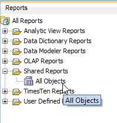

### [020 - Create Editor XML Extension](https://github.com/PhilippSalvisberg/sqldev/tree/main/workshop/020_create_editor_xml_extension/README.md#create-editor-xml-extension)

Show details for a selected node in the Connections window. This is called an editor. Technically it's just a report.

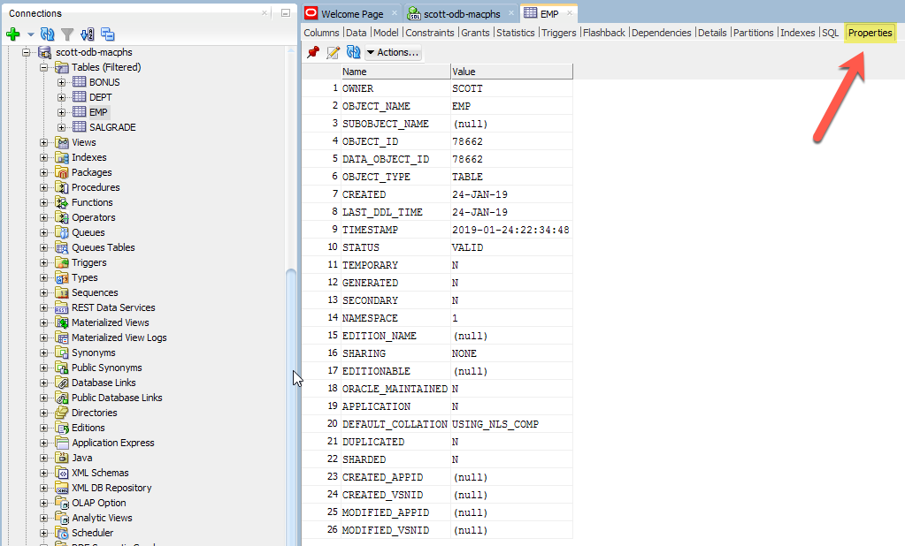

### [030 - Create Navigator XML Extension](https://github.com/PhilippSalvisberg/sqldev/tree/main/workshop/030_create_navigator_xml_extension/README.md#create-navigator-xml-extension)

Create a new node with children and grandchildren int the Connections navigator tree.

### [032 - Add Editors to Navigator XML Extension](https://github.com/PhilippSalvisberg/sqldev/tree/main/workshop/032_add_editors_for_navigator/README.md#add-editors-to-navigator-xml-extension)

Add two editors for some nodes of the previously created navigator.

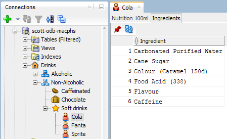

### [040 - Create PL/SQL Action XML Extension](https://github.com/PhilippSalvisberg/sqldev/tree/main/workshop/040_create_plsql_action_xml_extension/README.md#create-plsql-action-xml-extension)

Create a context menu item and a dialog to enter some parameters for an action to be performed. The action is implemented as an anonymous PL/SQL block.

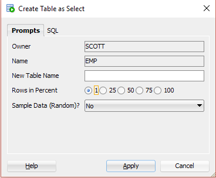

### [042 - Create JavaScript Action XML Extension](https://github.com/PhilippSalvisberg/sqldev/tree/main/workshop/042_create_javascript_action_xml_extension/README.md#create-javascript-action-xml-extension)

Create the same context menu item and dialog as in the previous example. In this case the action is implemented in JavaScript instead of PL/SQL.

Beside accessing the database you may access also Java classes thanks to the [Nashorn script engine](https://docs.oracle.com/javase/8/docs/technotes/guides/scripting/nashorn/). Hence you may access the local file system and the network. And of course you may produce additional GUI components.

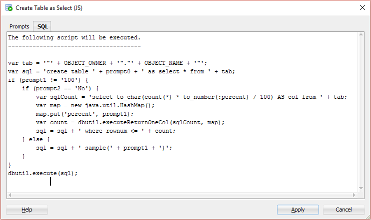

## Basic Extensions (XML)

SQL Developer extensions are ZIP files in a specific format. The format is defined in the [JDeveloper's Extension Software Development Kit (ESDK) version 2.0](https://docs.oracle.com/middleware/1212/jdev/OJDEG/toc.htm).

These tutorials bundle the previously created XML extensions into a single extension (ZIP file). The `Java` code is reduced to a single file to handle custom resources, e.g. icons. The final ZIP file is built by Maven.

### [050 - Create Bundled XML Extension](https://github.com/PhilippSalvisberg/sqldev/tree/main/workshop/050_create_bundled_xml_extension/README.md#create-bundled-xml-extension)

Create an extension (ZIP file) including all previously created XML extensions.

  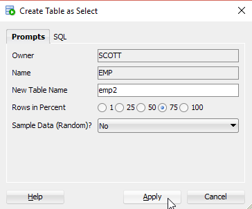

### [052 - Create Bundled Multilingual XML Extension](https://github.com/PhilippSalvisberg/sqldev/blob/main/workshop/052_create_bundled_multilingual_xml_extension/README.md#create-bundled-multilingual-xml-extension)

Support an additional language (German) beside English in the previously created extension.

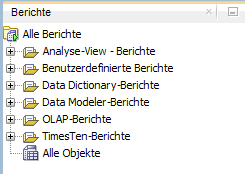 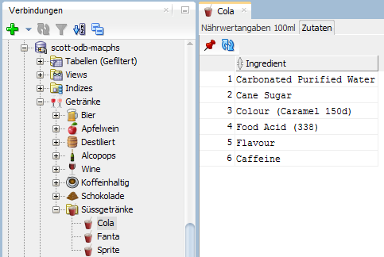 

## Full-blown Extensions (XML & Java)

XML Extensions have limitations. Even if JavaScript Actions are used. To get the most out of the ESDK, more XML configuration and Java code is required.

### [060 - Extend Menubar](https://github.com/PhilippSalvisberg/sqldev/tree/main/workshop/060_extend_menubar/README.md#extend-menubar)

Extend every menu in the main menubar and create a custom menu.

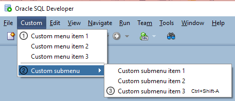

### [070 - Extend Toolbar](https://github.com/PhilippSalvisberg/sqldev/tree/main/workshop/070_extend_toolbar/README.md#extend-toolbar)

Extend the main toolbar. Inspect variables with the debugger and hot deploy code changes.

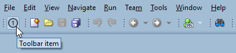

### [080 - Extend Context Menu](https://github.com/PhilippSalvisberg/sqldev/tree/main/workshop/080_extend_context_menu/README.md#extend-context-menu)

Extend the context menu in the navigator node and PL/SQL editor. Access connection properties such as username and password.

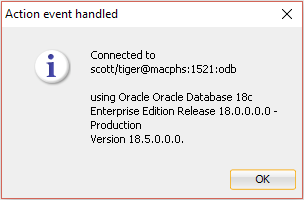

### [090 - Add Preferences](https://github.com/PhilippSalvisberg/sqldev/tree/main/workshop/090_add_preferences/README.md#add-preferences)

Add a preference dialog to the previously created extension. Add conditional processing based on the current preference settings, e.g. to show or to hide the password of a connection.

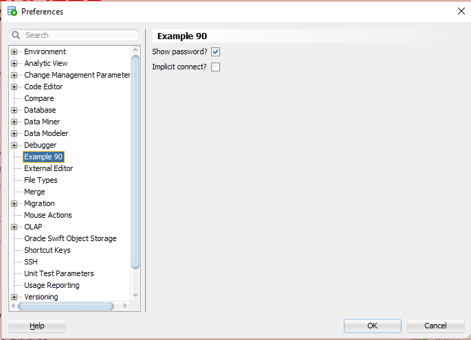

### [100 - Add Dockable Window](https://github.com/PhilippSalvisberg/sqldev/blob/main/workshop/100_add_dockable_window/README.md#add-dockable-window)

Show a new dockable window via main menu action.

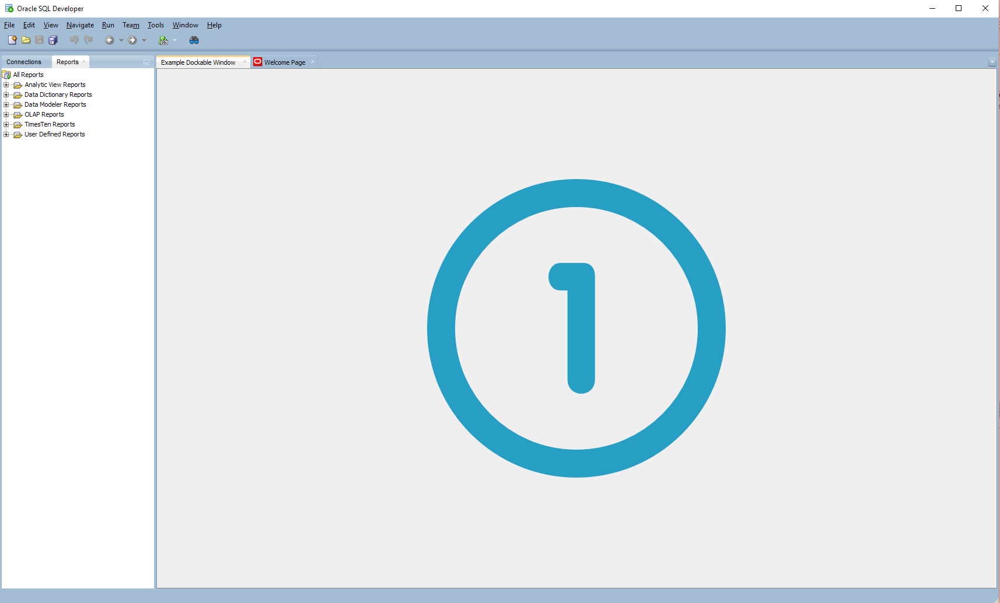

### [110 - Extend Context Menu of Grid Table](https://github.com/PhilippSalvisberg/sqldev/blob/main/workshop/110_grid_table_menu/README.md#extend-context-menu-of-grid-table)

Extend the context menu of any grid table (query results, reports, editors, etc.) in SQL Developer. 

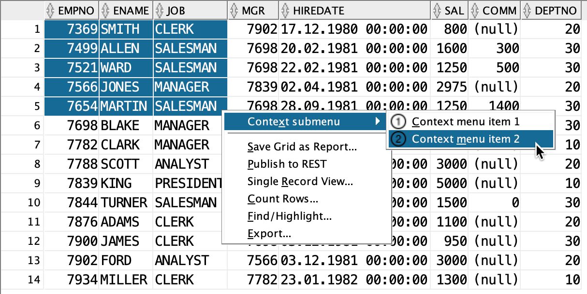

# Documentation

## In this Repository

- [SQL Developer versions](docs/sqldev-versions.md)
- [Trigger Hooks](docs/trigger-hooks.md)
- [Remote Debugging in Eclipse](docs/remote-debugging.md)

## External Links

- JDeveloper
  - [JDeveloper History](https://www.oracle.com/application-development/technologies/jdeveloper/jdev-history.html)
  - [JDevelopers's Extension Software Development Kit (EDSK)](https://www.oracle.com/tools/downloads/jdeveloper-extension-sdk.html)
  - [EDSK v2.0 JavaDoc (12.2.1.4.0)](https://docs.oracle.com/en/middleware/developer-tools/jdeveloper/12.2.1.4/api-reference-esdk/index.html)
  - [Fusion Middleware Developer's Guide for Oracle JDeveloper Extensions (12.2.1.4.0)](https://docs.oracle.com/en/middleware/developer-tools/jdeveloper/12.2.1.4/develop-extensions/index.html)

- SQL Developer
  - [SQL Developer Documentation](https://docs.oracle.com/en/database/oracle/sql-developer/)
  - [GitHub repository for Oracle Database examples (SQL Developer Extensions)](https://github.com/oracle/oracle-db-examples/tree/master/sqldeveloper)
  - [XML Schemas of User Defined Extensions](https://github.com/oracle/oracle-db-examples/tree/master/sqldeveloper/extension/xml/schema)

- 3rd Party OpenSource Examples
  - [Show Me Password](https://github.com/tomecode/show-me-password-sqldev-jdev)
  - [Keep-alive Extension for SQL Developer](https://github.com/scristalli/SQL-Developer-4-keepalive)
  - [utPLSQL for SQL Developer](https://github.com/utPLSQL/utPLSQL-SQLDeveloper)
  - [plscope-utils for SQL Developer](https://github.com/PhilippSalvisberg/plscope-utils/tree/main/sqldev)
  - [oddgen – our dictionary-driven generator](https://github.com/oddgen/oddgen)
  - [Bitemp Remodeler for SQL Developer](https://github.com/oddgen/bitemp)
