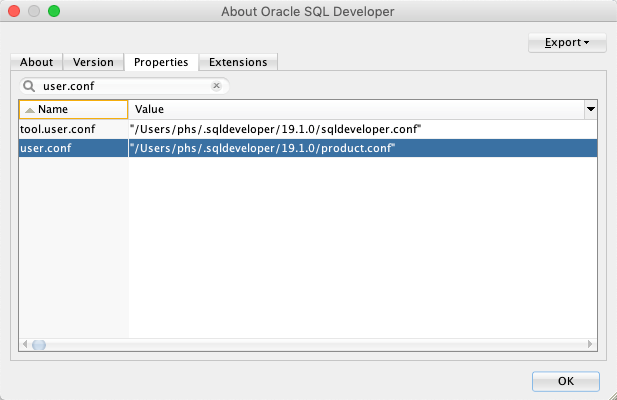
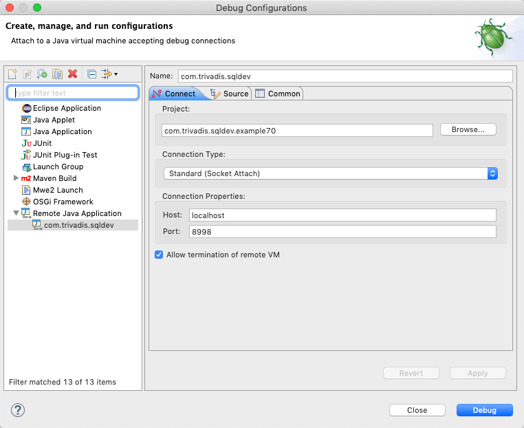
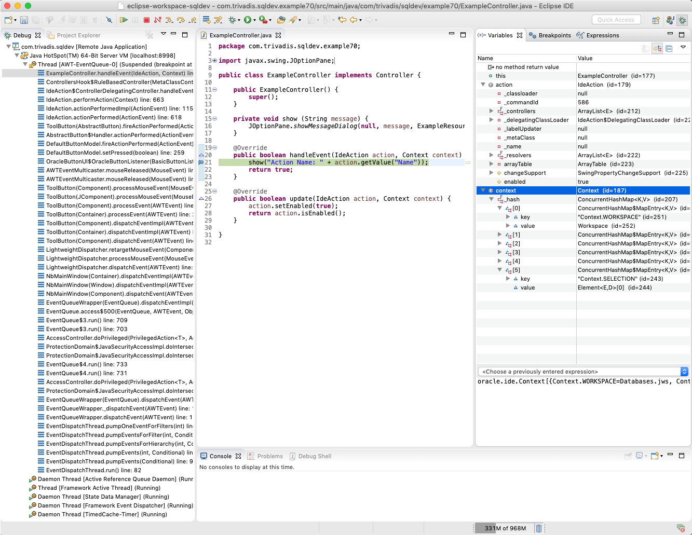
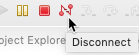

# Remote Debugging in Eclipse

## 1. Enable Debug in `product.conf`

Add the folloing to your `product.conf`:

```
AddVMOption -Xdebug
AddVMoption -Xrunjdwp:transport=dt_socket,address=8998,server=y,suspend=n
```

See `user.conf` property in the `Properties` tab of SQL Developer's `About` dialog for the exact location of your `product.conf` file.



The option `suspend=y` would suspend SQL Developer during startup until the debugger connects. You do not want this, unless when debugging the startup process itself. `suspend=n` will allow to start SQL Developer normally. The debugger can connect and disconnect antime while SQL Developer is running. This is much more convenient and leads to less misunderstandings, because e.g. the SQL Developer does not seem to start because it is waiting for a debugging session.

See [Java 8 Connection and Invocation Details](https://docs.oracle.com/javase/8/docs/technotes/guides/jpda/conninv.html)

## 2. Configure Remote Debug 

Add the following debug configuration for your extension project. The port number has to match the one entered in `product.conf`. 



## 3. Start SQL Developer

Start SQL Developer.

## 4. Debug

Set a breakpoint in your Java code and start the previously configured Debug Configuration.

The debuger will suspend the process when it reaches a breakpoint.



Disconnect from SQL Developer after debugging.

 

## 5. Stop SQL Developer

Stop the SQL Developer in the normal way. Do not press the `Terminate` button in the debugger to avoid data loss. 

## 6. Disable Debug in `product.conf`

Delete or comment out the two previously added `AddVMOption` entries. 

However, if you debug frequently, it is more convenient to keep SQL Developer ready for incoming debugging connections.
