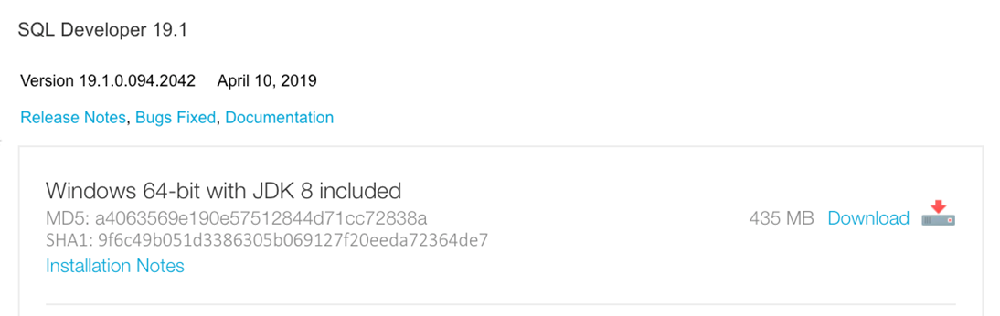
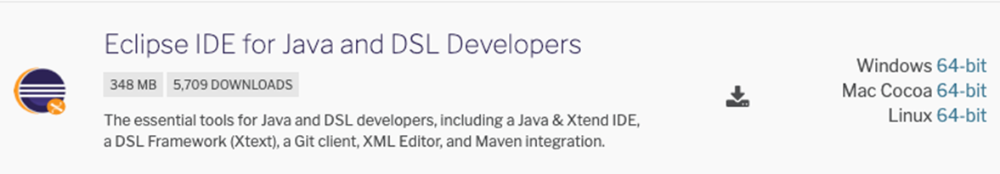
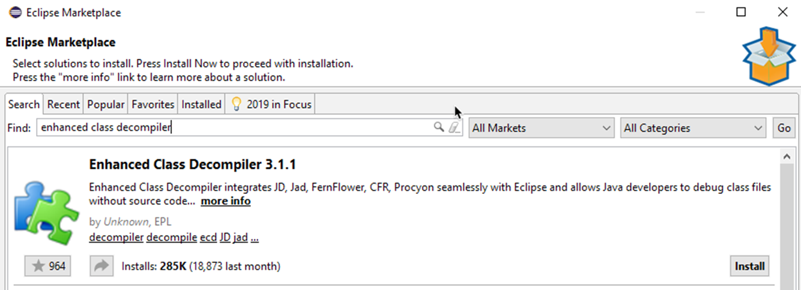
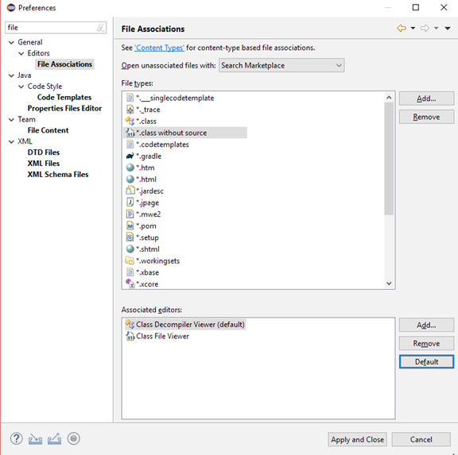
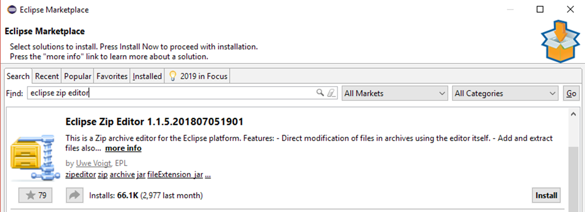

# Set up the Environment

## 1. About OS, Versions and Names

The tutorials are designed for `Windows 10 (64-bit)` with an English user interface for all software components.

The tutorials are based on specific software versions and folder names.

The provided Maven build files can be executed technically unchanged on `Windows` and `macOS` if SQL Developer is installed in the predefined folder. For `Linux` you have to pass the parameter `-Dsqldev.basedir=` with the path to the installation directory of SQL Developer.

Technically, the examples work with any folder structure. However, you must be careful when copying and pasting values from the tutorial text.

## 2. Install SQL Developer

Download SQL Developer from [Oracle Technology Network](https://www.oracle.com/technetwork/developer-tools/sql-developer/downloads/index.html):



Extract `sqldeveloper-19.1.0.094.2042-x64.zip` in `C:\app`.

Rename `C:\app\sqldeveloper` to `C:\app\sqldeveloper19.1.0`.

## 3. Change Language of SQL Developer to English

Open `%APPDATA%\sqldeveloper\19.1.0\product.conf` in an editor and add the following lines:

```text
#AddVMOption -Duser.language=en	
#AddVMOption -Duser.country=US
#AddVMOption -Duser.region=US
```

This entries change the language of SQL Developer to English.

`country` and `region` are required only to avoid issues with some Oracle Database versions.

## 4. Change Logging Configuration in SQL Develper.

Rename the file `C:\app\sqldeveloper19.1.0\sqldeveloper\bin\logging.conf` to `C:\app\sqldeveloper19.1.0\sqldeveloper\bin\logging.conf.original`.

Create the the file `C:\app\sqldeveloper19.1.0\sqldeveloper\bin\logging.conf` with the following content:

```text
#handler for console only (will be shown in "Messages" tab of "Log" view within SQL Developer)
handlers=java.util.logging.ConsoleHandler

# Default global logging level. 
.level=SEVERE

# Default logging for Oracle (filters also other classes in "Logging Page" tab of "Log" view)
oracle.level=FINE

# Logging for Trivadis example extensions
com.trivadis.sqldev.level=FINE

# --- ConsoleHandler --- 
java.util.logging.ConsoleHandler.level=FINE
java.util.logging.ConsoleHandler.formatter=java.util.logging.SimpleFormatter
java.util.logging.SimpleFormatter.format=%1$tY-%1$tm-%1$td %1$tH:%1$tM:%1$tS %4$s %3$s: %5$s%n
```

## 5. Install Eclipse

Download the `Eclipse IDE for Java and DSL Developers` from https://www.eclipse.org/downloads/packages/ for Windows 64-bit. This version includes also [`Xtend`](https://www.eclipse.org/xtend/) support, that simplifies the work with SQL Developer Extensions written in `Xtend`.



Extract `eclipse-dsl-2019-03-R-win32-x86_64.zip` in `C:\app`.

Rename `C:\app\eclipse` to `C:\app\eclipse-sqldev`.

Launch `C:\app\eclipse-sqldev\eclipse.exe` with a workspace name of your choice.

## 6. Install Eclipse Plugin – Enhanced Class Decompiler (optional)

Select `Eclipse Marketplace...` from the `Help` menu.

Search for `Enhanced Class Decompiler` and install it.



Select `Preferences` from the `Window` menu and search for `File`.



Associate `Class Decompiler Viewer` with
- `.class` (required for remote debugging only)
- `.class without source`

## 7. Install Eclipse Plugin – Eclipse Zip Editor (optional)

Select `Eclipse Marketplace...` from the `Help` menu.

Search for `Eclipse Zip Editor` and install it.

