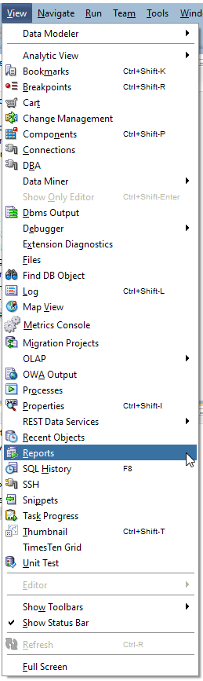
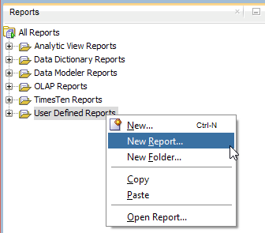
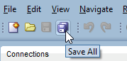
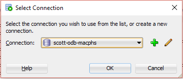

# Create Report as XML Extension

## 1. Start SQL Developer

Start SQL Developer.

## 2. Create Report

Select `View`->`Reports` in the main menu.



Right click on `User Defined Reports` and select `New Report...`.



and you get this `Create Report` dialog:


Enter `All objects` in the name field and 

```sql
select * from all_objects
order by owner, object_type, object_name
```

in the SQL field and press the `Apply` button.

`User Defined Reports` is shown in italic letters. 


This means that the report is not yet saved. Press the `Save All` button in the toolbar to save the report.



Click on the `All Objects` report and select a connection from the `Select Connection` dialog to show the report.



## 3. Save Report as XML File

Right click on the `All Objects` report and select `Save As...`.


And save the report as `all_objects.xml` in a folder of your choice.

## 4. Delete Report

Right click on the `All Objects` report and select `Delete` and confirm the deletion.


## 5. Configure Report as XML Extension

Select `Tools`->`Preferences` from the main menu.


In the preferences dialog click on `User Defined Extensions` under the `Database` node.


Press the `Add Row` button and select `REPORT` in the type field and browse for the previously saved `all_objects.xml`.


And press the `OK`.

## 6. Restart SQL Developer

You must restart SQL developer for the changes to take effect. Close SQL Developer and start it again.

## 7. Run Report

Now you find the `All Objects` report in the Report window under the `Shared Report` node.


Click on `All Objects` to run it.
