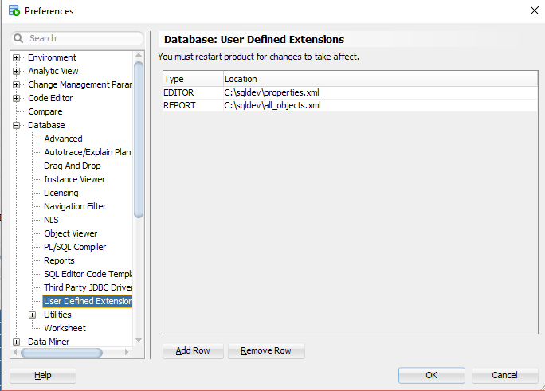
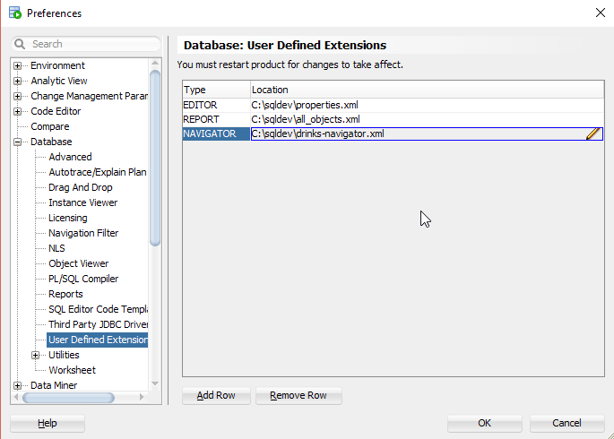
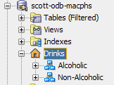
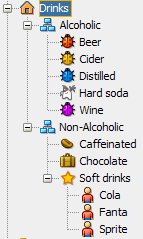

# Create Navigator XML Extension

## 1. Start SQL Developer

Start SQL Developer.

## 2. Create XML file

Save the following content to a XML file named `drinks-navigator.xml`.

```xml
<navigator RESOURCE_FILE="oracle.dbtools.raptor.navigator.OracleNavigatorResource">
	<objectType connType="Oracle" id="drinks-root" weight="203">
		<folder>
			<!-- see oracle.javatools.icons.OracleIcons.class in modules/oracle.javatools/oracle.javatools/oicons.jar -->
			<icon RSKEY="OracleIcons.HOME"></icon>
			<!-- RSKEY should reference a resource in the bundle, however it works, but throws error in log -->
			<label RSKEY="Drinks"/>
			<queries>
				<query>
					<sql  constrained="true">
						<![CDATA[
SELECT 'Alcoholic' AS name, 'ALCOHOLIC' AS value FROM dual
UNION ALL
SELECT 'Non-Alcoholic' AS name, 'NON-ALCOHOLIC' AS value FROM dual
						]]>
					</sql>
				</query>
			</queries>
		</folder>
		<node>
			<icon RSKEY="OracleIcons.SCHEMA_FOLDER"></icon>
			<childType id="beer-folder" nodeType="beer-folder">
				<queries>
					<query>
						<sql>
							<![CDATA[
SELECT 'Beer' AS name, 'BEER' as value 
  FROM dual
 WHERE :VALUE = 'ALCOHOLIC'
								]]>
						</sql>
					</query>
				</queries>
			</childType>
			<childType id="cider-folder" nodeType="cider-folder">
				<queries>
					<query>
						<sql>
							<![CDATA[
SELECT 'Cider' AS name, 'CIDER' as value 
  FROM dual
 WHERE :VALUE = 'ALCOHOLIC'
								]]>
						</sql>
					</query>
				</queries>
			</childType>
			<childType id="distilled-folder" nodeType="distilled-folder">
				<queries>
					<query>
						<sql>
							<![CDATA[
SELECT 'Distilled' AS name, 'DISTILLED' as value 
  FROM dual
 WHERE :VALUE = 'ALCOHOLIC'
								]]>
						</sql>
					</query>
				</queries>
			</childType>
			<childType id="hard-soda-folder" nodeType="hard-soda-folder">
				<queries>
					<query>
						<sql>
							<![CDATA[
SELECT 'Hard soda' AS name, 'HARD SODA' as value 
  FROM dual
 WHERE :VALUE = 'ALCOHOLIC'
								]]>
						</sql>
					</query>
				</queries>
			</childType>
			<childType id="wine-folder" nodeType="wine-folder">
				<queries>
					<query>
						<sql>
							<![CDATA[
SELECT 'Wine' AS name, 'WINE' as value 
  FROM dual
 WHERE :VALUE = 'ALCOHOLIC'
								]]>
						</sql>
					</query>
				</queries>
			</childType>
			<childType id="caffeinated-folder" nodeType="caffeinated-folder">
				<queries>
					<query>
						<sql>
							<![CDATA[
SELECT 'Caffeinated' AS name, 'CAFFEINATED' as value 
  FROM dual
 WHERE :VALUE = 'NON-ALCOHOLIC'
								]]>
						</sql>
					</query>
				</queries>
			</childType>
			<childType id="chocolate-folder" nodeType="chocolate-folder">
				<queries>
					<query>
						<sql>
							<![CDATA[
SELECT 'Chocolate' AS name, 'CHOCOLATE' as value 
  FROM dual
 WHERE :VALUE = 'NON-ALCOHOLIC'
								]]>
						</sql>
					</query>
				</queries>
			</childType>
			<childType id="soft-drinks-folder" nodeType="soft-drinks-folder">
				<queries>
					<query>
						<sql>
							<![CDATA[
SELECT 'Soft drinks' AS name, 'SOFT DRINKS' as value 
  FROM dual
 WHERE :VALUE = 'NON-ALCOHOLIC'
								]]>
						</sql>
					</query>
				</queries>
			</childType>
		</node>
	</objectType>
	<objectType connType="Oracle" id="beer-folder">
		<node>
			<icon RSKEY="OracleIcons.DEBUG" />
		</node>
	</objectType>	
	<objectType connType="Oracle" id="cider-folder">
		<node>
			<icon RSKEY="OracleIcons.DEBUG_YELLOW" />
		</node>
	</objectType>
	<objectType connType="Oracle" id="distilled-folder">
		<node>
			<icon RSKEY="OracleIcons.DEBUG_BLUE" />
		</node>
	</objectType>
	<objectType connType="Oracle" id="hard-soda-folder">
		<node>
			<icon RSKEY="OracleIcons.DUKE" />
		</node>
	</objectType>	
	<objectType connType="Oracle" id="wine-folder">
		<node>
			<icon RSKEY="OracleIcons.DEBUG_PURPLE" />
		</node>
	</objectType>	
	<objectType connType="Oracle" id="caffeinated-folder">
		<node>
			<icon RSKEY="OracleIcons.EJBENTITY" />
		</node>
	</objectType>	
	<objectType connType="Oracle" id="chocolate-folder">
		<node>
			<icon RSKEY="OracleIcons.APPLICATIONMODULE" />
		</node>
	</objectType>	
	<objectType connType="Oracle" id="soft-drinks-folder">
		<node>
			<icon RSKEY="OracleIcons.FAVORITES" />
			<childType id="soft-drinks" nodeType="soft-drinks">
				<queries>
					<query>
						<sql>
							<![CDATA[
SELECT 'Cola' AS name, 'COLA' as value 
  FROM dual
UNION ALL
SELECT 'Fanta' AS name, 'FANTA' as value 
  FROM dual
UNION ALL
SELECT 'Sprite' AS name, 'SPRITE' as value 
  FROM dual
		 					]]>
						</sql>					
					</query>
				</queries>
			</childType>
		</node>
	</objectType>
	<objectType connType="Oracle" id="soft-drinks">
		<node>
			<icon RSKEY="OracleIcons.USER" />
		</node>
	</objectType>	
</navigator>
```
See [navigator.xsd](https://github.com/oracle/oracle-db-examples/blob/master/sqldeveloper/extension/xml/schema/navigator.xsd) for more information about the XML structure.


## 3. Configure the XML Extension

Select `Tools`->`Preferences` from the main menu.


In the preferences dialog click on `User Defined Extensions` under the `Database` node.



Press the `Add Row` button and select `NAVIGATOR` in the type field and browse for the previously saved `drinks-navigator.xml`.



## 4. Restart SQL Developer

You must restart SQL developer for the changes to take effect. Close SQL Developer and start it again.

## 5. Show Navigator

Open a connection and click on the `Drinks` node.



Expand all nodes.


