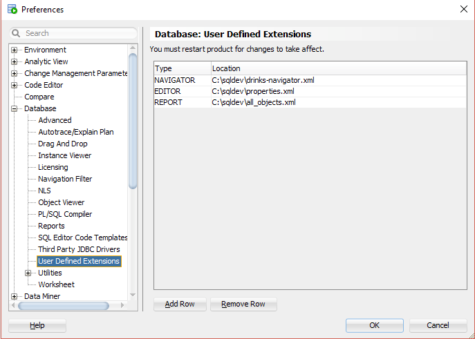
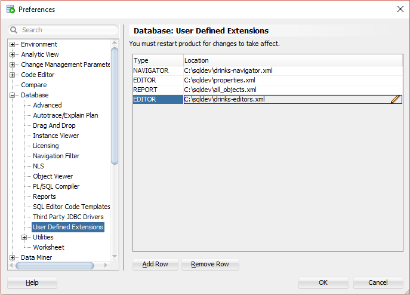
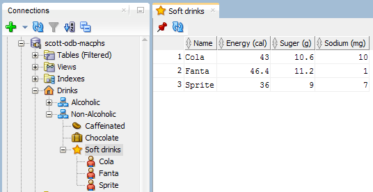
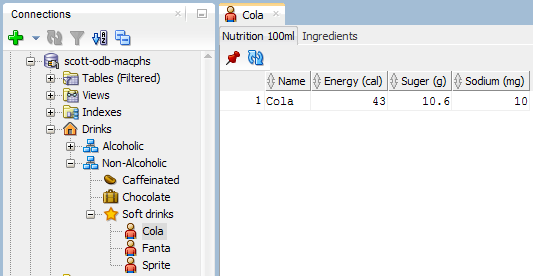

# Add Editors to Navigator XML Extension

## 1. Start SQL Developer

Start SQL Developer.

## 2. Create XML file

Save the following content to a XML file named `drinks-editors.xml`.

```xml
<?xml version="1.0" encoding="UTF-8" ?>
<displays>
	<display type="editor" style="Table" enable="true" 
		objectType="beer-folder,cider-folder,distilled-folder,hard-soda-folder,wine-folder,caffeinated-folder,chocolate-folder,soft-drinks-folder,soft-drinks">
		<name><![CDATA[Nutrition 100ml]]></name>
		<description><![CDATA[]]></description>
		<tooltip><![CDATA[]]></tooltip>
		<drillclass><![CDATA[]]></drillclass>
		<CustomValues>
			<TYPE><![CDATA[horizontal]]></TYPE>
		</CustomValues>
		<query>
			<sql>
				<![CDATA[
select object_name as "Name",
       energy_cal  as "Energy (cal)", 
       suger_g     as "Suger (g)", 
       sodium_mg   as "Sodium (mg)"
  from (
	-- see https:/www.coca-colajourney.com.au/compare-products
	select 'Cola' as object_name,
	       'soft-drinks' as object_type,
	       43.0 as energy_cal,
	       10.6 as suger_g,
	       10.0 as sodium_mg
	  from dual
	union all
	select 'Fanta' as object_name,
	       'soft-drinks' as object_type,
	       46.4 as energy_cal,
	       11.2 as suger_g,
	       1.0 as sodium_mg
	  from dual
	union all
	select 'Sprite' as object_name,
	       'soft-drinks' as object_type,
	       36.0 as energy_cal,
	       9.0 as suger_g,
	       7.0 as sodium_mg
	  from dual
  )
 where object_type = :OBJECT_TYPE and object_name = :OBJECT_NAME 
    or object_type || '-folder' = :OBJECT_TYPE
 order by object_name
 				]]>
			</sql>
		</query>
	</display>
	<display type="editor" style="Table" enable="true" 
		objectType="soft-drinks">
		<name><![CDATA[Ingredients]]></name>
		<description><![CDATA[]]></description>
		<tooltip><![CDATA[]]></tooltip>
		<drillclass><![CDATA[]]></drillclass>
		<CustomValues>
			<TYPE><![CDATA[horizontal]]></TYPE>
		</CustomValues>
		<query>
			<sql>
				<![CDATA[
select ingredient  as "Ingredient"
  from (
	-- see https:/www.coca-colajourney.com.au/compare-products
	select 'Cola' as object_name,
	       'soft-drinks' as object_type,
	       'Carbonated Purified Water' as ingredient
	  from dual
	union all
	select 'Cola' as object_name,
	       'soft-drinks' as object_type,
	       'Cane Sugar' as ingredient
	  from dual
	union all
	select 'Cola' as object_name,
	       'soft-drinks' as object_type,
	       'Colour (Caramel 150d)' as ingredient
	  from dual
	union all
	select 'Cola' as object_name,
	       'soft-drinks' as object_type,
	       'Food Acid (338)' as ingredient
	  from dual
	union all
	select 'Cola' as object_name,
	       'soft-drinks' as object_type,
	       'Flavour' as ingredient
	  from dual
	union all
	select 'Cola' as object_name,
	       'soft-drinks' as object_type,
	       'Caffeine' as ingredient
	  from dual
    union all
	select 'Fanta' as object_name,
	       'soft-drinks' as object_type,
	       'Carbonated Water' as ingredient
	  from dual
    union all
	select 'Fanta' as object_name,
	       'soft-drinks' as object_type,
	       'Suger' as ingredient
	  from dual
    union all
	select 'Fanta' as object_name,
	       'soft-drinks' as object_type,
	       'Orange Juice from Concentrate (2.1%)' as ingredient
	  from dual
    union all
	select 'Fanta' as object_name,
	       'soft-drinks' as object_type,
	       'Food Acid (330)' as ingredient
	  from dual
    union all
	select 'Fanta' as object_name,
	       'soft-drinks' as object_type,
	       'Flavour' as ingredient
	  from dual
    union all
	select 'Fanta' as object_name,
	       'soft-drinks' as object_type,
	       'Natural Colour (160c)' as ingredient
	  from dual
    union all
	select 'Fanta' as object_name,
	       'soft-drinks' as object_type,
	       'Preservative (202)' as ingredient
	  from dual
    union all
	select 'Fanta' as object_name,
	       'soft-drinks' as object_type,
	       'Antioxidant (300)' as ingredient
	  from dual
    union all
	select 'Sprite' as object_name,
	       'soft-drinks' as object_type,
	       'Carbonated Water' as ingredient
	  from dual
    union all
	select 'Sprite' as object_name,
	       'soft-drinks' as object_type,
	       'Sugar' as ingredient
	  from dual
    union all
	select 'Sprite' as object_name,
	       'soft-drinks' as object_type,
	       'Food Acids (330, 331)' as ingredient
	  from dual
    union all
	select 'Sprite' as object_name,
	       'soft-drinks' as object_type,
	       'Flavour' as ingredient
	  from dual
    union all
	select 'Sprite' as object_name,
	       'soft-drinks' as object_type,
	       'Preservative (202)' as ingredient
	  from dual
    union all
	select 'Sprite' as object_name,
	       'soft-drinks' as object_type,
	       'Sweetener (960)' as ingredient
	  from dual
  )
 where object_type = :OBJECT_TYPE and object_name = :OBJECT_NAME 
 				]]>
			</sql>
		</query>
	</display>
</displays>
```

## 3. Configure the XML Extension

Select `Tools`->`Preferences` from the main menu.


In the preferences dialog click on `User Defined Extensions` under the `Database` node.



Press the `Add Row` button and select `EDITOR` in the type field and browse for the previously saved `drinks-editors.xml`.



## 4. Restart SQL Developer

You must restart SQL developer for the changes to take effect. Close SQL Developer and start it again.

## 5. Show Editor for `soft-drinks-folder`

Open a connection, click on the `Drinks` node, expand all nodes and click on the `Soft drinks` node.



## 6. Show Editors for `soft-drinks`

Click on the `Cola` node.



Click on the `Ingredients` tab.


