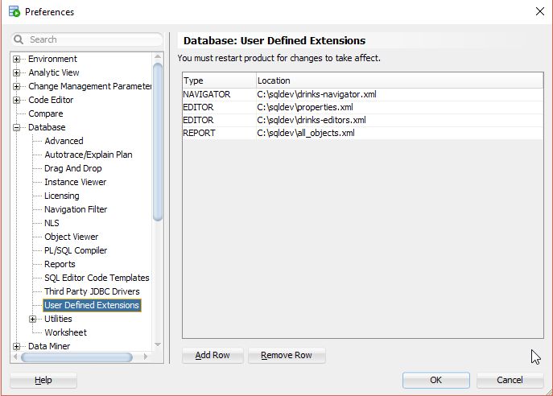
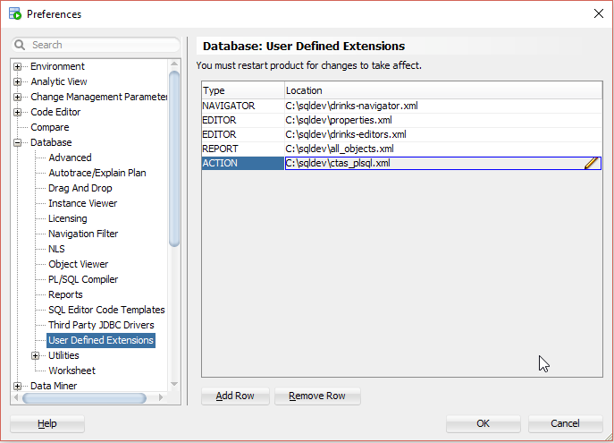

# Create PL/SQL Action XML Extension

## 1. Start SQL Developer

Start SQL Developer.

## 2. Create XML file

Save the following content to a XML file named `ctas_plsql.xml`.

```xml
<items>
	<item type="TABLE" reloadparent="true">
		<title>Create Table as Select...</title>
		<prompt>
			<label>New Table Name</label>
		</prompt>
		<prompt type="radio">
			<label>Rows in Percent</label>
			<value><![CDATA[STATIC:1:25:50:75:100]]></value>
		</prompt>
		<prompt>
			<label>Sample Data (Random)?</label>
			<value><![CDATA[STATIC:No:Yes]]></value>
		</prompt>
		<sql>
			<![CDATA[
declare
   l_sql varchar2(32767) := 'create table #0# as select * from "#OBJECT_OWNER#"."#OBJECT_NAME#"';
   l_count integer;
begin
   if '#1#' != '100' then
      if '#2#' = 'No' then
         select count(*) * #1# / 100 into l_count from "#OBJECT_OWNER#"."#OBJECT_NAME#";
         l_sql := l_sql || ' where rownum <= ' || l_count;
      else
         l_sql := l_sql || ' sample(#1#)';
      end if;
   end if;
   execute immediate l_sql;
end;
			]]>
		</sql>
		<help>Copy a table. Completely or a chosen subset in percent.</help>
		<confirmation>
			<title>Confirmation</title>
			<prompt>Table "#OBJECT_NAME#" has been copied to #0#.</prompt>
		</confirmation>
	</item>
</items>
```
See [dialogs.xsd](https://github.com/oracle/oracle-db-examples/blob/main/sqldeveloper/extension/xml/schema/dialogs.xsd) for more information about the XML structure. It contains a lot of useful comments.

## 3. Configure the XML Extension

Select `Tools`->`Preferences` from the main menu.


In the preferences dialog click on `User Defined Extensions` under the `Database` node.



Press the `Add Row` button and select `ACTION` in the type field and browse for the previously saved `ctas_plsql.xml`.



## 4. Restart SQL Developer

You must restart SQL developer for the changes to take effect. Close SQL Developer and start it again.

## 5. Run

Open a connection, click on Tables, right-click on a table an select `Create Table as Select...`.


Enter a `New table name`, select `75` percent and press the `Apply button`.


