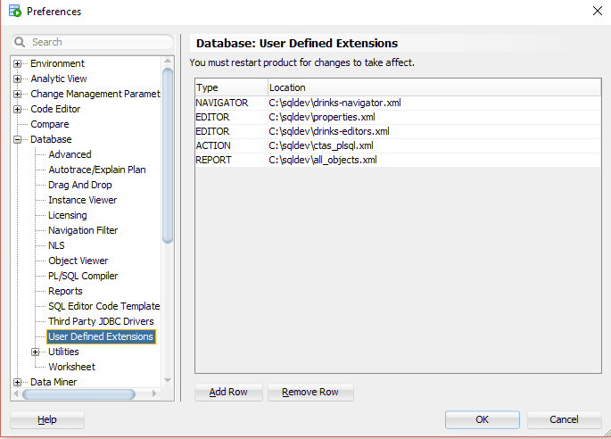
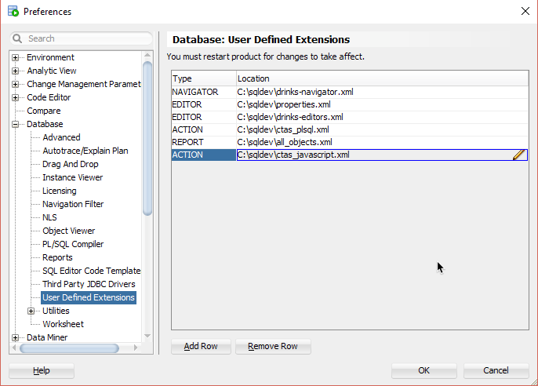
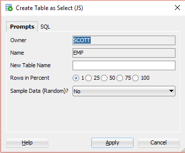
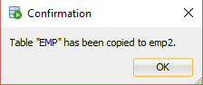

# Create JavaScript Action XML Extension

## 1. Start SQL Developer

Start SQL Developer.

## 2. Create XML file

Save the following content to a XML file named `ctas_javascript.xml`.

```xml
<items>
	<item type="TABLE" reloadparent="true">
		<title>Create Table as Select (JS)...</title>
		<prompt>
			<label>New Table Name</label>
		</prompt>
		<prompt type="radio">
			<label>Rows in Percent</label>
			<value><![CDATA[STATIC:1:25:50:75:100]]></value>
		</prompt>
		<prompt>
			<label>Sample Data (Random)?</label>
			<value><![CDATA[STATIC:No:Yes]]></value>
		</prompt>
		<script>
			<![CDATA[
var tab = '"' + OBJECT_OWNER + '"."' + OBJECT_NAME + '"';			
var sql = 'create table ' + prompt0 + ' as select * from ' + tab;
if (prompt1 != '100') {
	if (prompt2 == 'No') {
		var sqlCount = 'select to_char(count(*) * to_number(:percent) / 100) AS col from ' + tab;
		var map = new java.util.HashMap();
		map.put('percent', prompt1);
		var count = dbutil.executeReturnOneCol(sqlCount, map);
		sql = sql + ' where rownum <= ' + count;
	} else {
		sql = sql + ' sample(' + prompt1 + ')';
	}
}
dbutil.execute(sql);
			]]>
		</script>
		<help>Copy a table. Completely or a chosen subset in percent.</help>
		<confirmation>
			<title>Confirmation</title>
			<prompt>Table "#OBJECT_NAME#" has been copied to #0#.</prompt>
		</confirmation>
	</item>
</items>
```
See [dialogs.xsd](https://github.com/oracle/oracle-db-examples/blob/master/sqldeveloper/extension/xml/schema/dialogs.xsd) for more information about the XML structure. It contains a lot of useful comments.

## 3. Configure the XML Extension

Select `Tools`->`Preferences` from the main menu.


In the preferences dialog click on `User Defined Extensions` under the `Database` node.



Press the `Add Row` button and select `ACTION` in the type field and browse for the previously saved `ctas_javascript.xml`.



## 4. Restart SQL Developer

You must restart SQL developer for the changes to take effect. Close SQL Developer and start it again.

## 5. Run

Open a connection, click on Tables, right-click on a table an select `Create Table as Select (JS)...`.



Enter a `New table name`, select `75` percent and press the switch to the `SQL` tab.


Now, press the `Apply button`.


