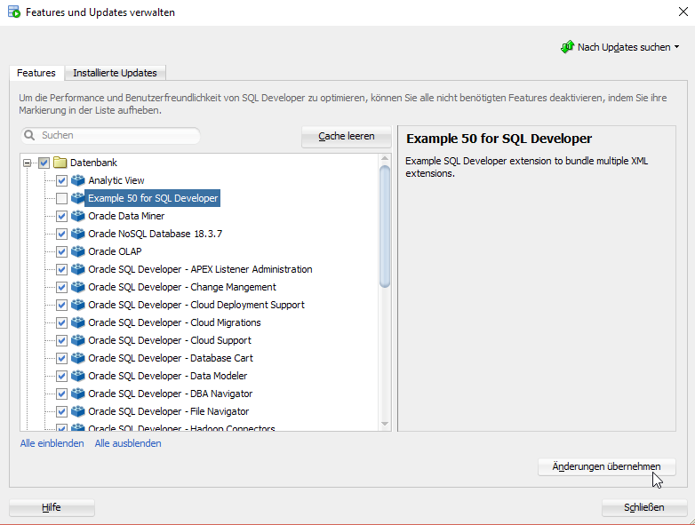
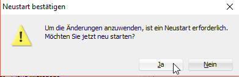
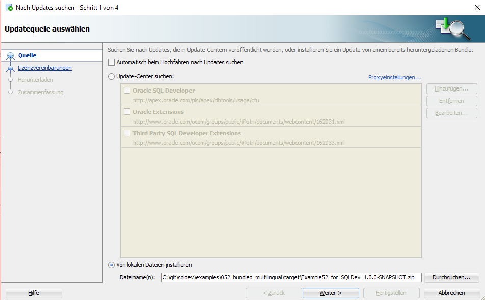
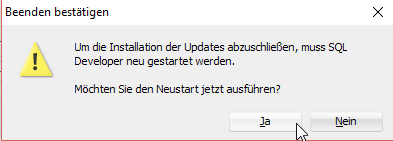
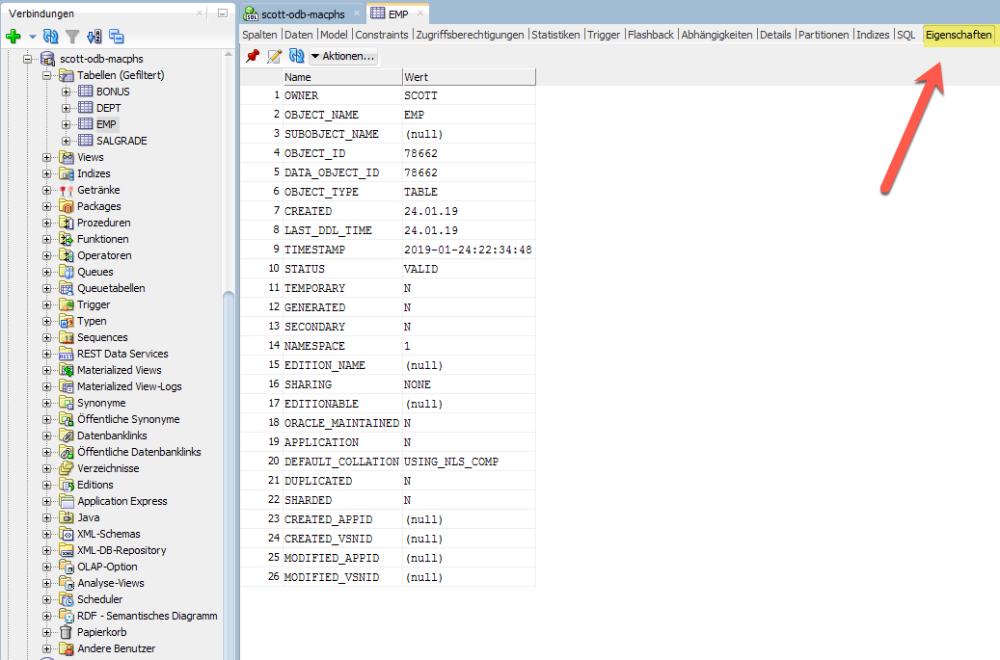
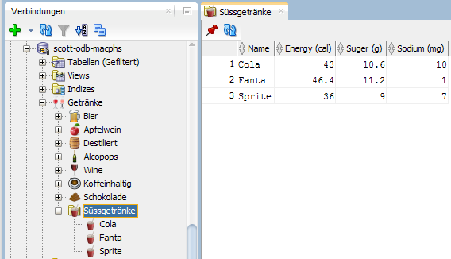
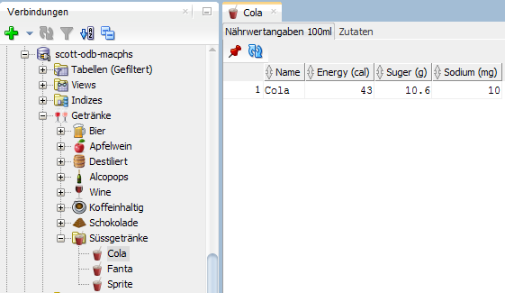
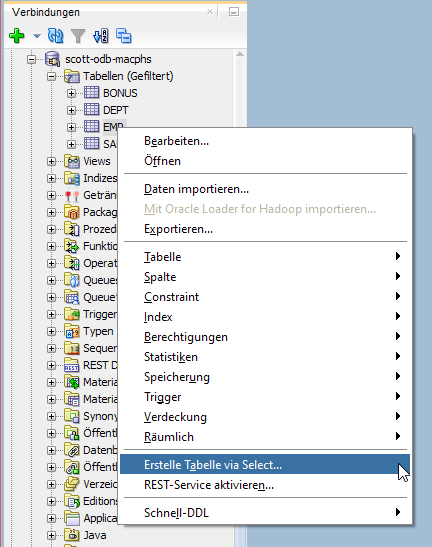
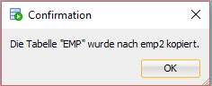

# Create Bundled Multilingual XML Extension

## 1. Start Eclipse

Start Eclipse and select the `sqldev` workspace created in [Create Bundled XML Extension](https://github.com/PhilippSalvisberg/sqldev/tree/master/workshop/050_create_bundled_xml_extension).

## 2. Open example `052_bundled_multilingual`

Select `File`->`Import...` from the main menu.

Select `Existing Maven Projects...`, select the root directory `C:\git\sqldev\examples\052_bundled_multilingual` and press `Finish`.

## 3. Build the project

Right click on the project, select `Run As` and click on `Maven build...`.

Enter `clean package` in the `Goals` field and press `Run`.

The console output should look similar to the following:

```text
[INFO] Scanning for projects...
[INFO] 
[INFO] ---------< com.trivadis.sqldev:com.trivadis.sqldev.example52 >----------
[INFO] Building com.trivadis.sqldev.example52 1.0.0-SNAPSHOT
[INFO] -------------------------------[ bundle ]-------------------------------
...
[INFO] Building zip: C:\git\sqldev\examples\052_bundled_multilingual\target\Example52_for_SQLDev_1.0.0-SNAPSHOT.zip
[INFO] ------------------------------------------------------------------------
[INFO] BUILD SUCCESS
[INFO] ------------------------------------------------------------------------
[INFO] Total time: 13.860 s
[INFO] Finished at: 2019-04-24T19:16:44+02:00
[INFO] ------------------------------------------------------------------------
```

## 4. Close SQL Developer

Select `File`->`Exit` from the main menu.

## 5. Change Language to German

Open `"%APPDATA%\sqldeveloper\19.1.0\product.conf"` in an editor and add the following lines:

```text
AddVMOption -Duser.language=de	
AddVMOption -Duser.country=US
AddVMOption -Duser.region=US
```

Save the file.

## 6. Start SQL Developer

Start SQL Developer.

## 7. Disable Extension

Select `Extras`->`Features` from the main menu.

Open the `Datenbank` node, deselect `Example 50 for SQL Developer` and press `Änderungen übernehmen`.



Press `Ja`to restart SQL Developer.



## 8. Install Extension

Select `Hilfe`->`Nach Updates suchen...` from the main menu.

Click on `Von lokalen Dateien installieren`, enter `C:\git\sqldev\examples\052_bundled_multilingual\target\Example52_for_SQLDev_1.0.0-SNAPSHOT.zip` in `Dateiname(n)` and press `Weiter`.



Press `Fertigstellen`.


And Press `Ja` to restart SQL Developer.



## 9. View Translations

### 9.1 Report `Alle Objekte`

You find the `Alle Objekte` report in the `Berichte` window.


The report is translated in [`all_objects_de.xliff`](https://github.com/PhilippSalvisberg/sqldev/blob/master/examples/052_bundled_multilingual/src/main/resources/com/trivadis/sqldev/example52/report/all_objects_de.xliff#L6-L7).

Please note, that column names cannot be translated.

### 9.2 Editor `Eigenschaften`

Open a connection, click on the `Tabellen` node, click on a table and then on the `Eigenschaften` tab.



The editor is translated in [`properties_de.xliff`](https://github.com/PhilippSalvisberg/sqldev/blob/master/examples/052_bundled_multilingual/src/main/resources/com/trivadis/sqldev/example52/editor/properties_de.xliff#L6-L7).

### 9.3 Navigator and Editors for `Getränke`

Open a connection, click on the `Getränke` node, expand all nodes and click on the `Süssgetränke` node.



Please note that the structure differs from the previous example. The folders for `Alcoholic` and `Non-Alcoholic` are missing. 

Have a look at [`drinks-navigator.xml`](https://github.com/PhilippSalvisberg/sqldev/blob/master/examples/052_bundled_multilingual/src/main/resources/com/trivadis/sqldev/example52/navigator/drinks-navigator.xml) how the non-translateable column names have been replaced. Look for `icon` and `label` tags.

All translations are stored in [ExampleResources_de.properties](https://github.com/PhilippSalvisberg/sqldev/blob/master/examples/052_bundled_multilingual/src/main/resources/com/trivadis/sqldev/example52/ExampleResources_de.properties).

Click on the `Cola` node.



The editor is translated in [`drinks-editors_de.xliff`](https://github.com/PhilippSalvisberg/sqldev/blob/master/examples/052_bundled_multilingual/src/main/resources/com/trivadis/sqldev/example52/editor/drinks-editors_de.xliff#L6-L7).

Click on the `Zutaten` tab.


The editor is translated in [`drinks-editors_de.xliff`](https://github.com/PhilippSalvisberg/sqldev/blob/master/examples/052_bundled_multilingual/src/main/resources/com/trivadis/sqldev/example52/editor/drinks-editors_de.xliff#L10-L11).

### 9.4 Context Menu `Erstelle Tabelle via Select`

Open a connection, click on Tables, right-click on a table an select `Create Table as Select...`.



Enter a `Neuer name`, select `75` percent and press the `Anwenden` button.


Press the `OK` button.



Please note that `Beispieldaten (zufällig)?` is now a checkbox. See [`ctas_plsql.xml`](https://github.com/PhilippSalvisberg/sqldev/blob/master/examples/052_bundled_multilingual/src/main/resources/com/trivadis/sqldev/example52/action/ctas_plsql.xml#L11-L14).

The action is translated in [`ctas_plsql_de.xliff`](https://github.com/PhilippSalvisberg/sqldev/blob/master/examples/052_bundled_multilingual/src/main/resources/com/trivadis/sqldev/example52/action/ctas_plsql_de.xliff#L5-L28).

## 10. Close SQL Developer

Select `File`->`Exit` from the main menu.

## 11. Change Language to English

Open `"%APPDATA%\sqldeveloper\19.1.0\product.conf"` in an editor and remove the following lines:

```text
AddVMOption -Duser.language=de	
AddVMOption -Duser.country=US
AddVMOption -Duser.region=US
```

Save the file.

## 12. Start SQL Developer

Start SQL Developer.

## 13. View Original Extension Texts

- Report `All Objects`
- Editor `Properties`
- Navigator `Drinks`
- Context Menu `Create Table As Select`
