# Extend Menubar

## 1. Start Eclipse

Start Eclipse and select the `sqldev` workspace created in [Create Bundled XML Extension](https://github.com/PhilippSalvisberg/sqldev/tree/main/workshop/050_create_bundled_xml_extension).

## 2. Open example `060_menubar`

Select `File`->`Import...` from the main menu.

Select `Existing Maven Projects...`, select the root directory `C:\git\sqldev\examples\060_menubar` and press `Finish`.

## 3. Build the project

Right click on the project, select `Run As` and click on `Maven build...`.

Enter `clean package` in the `Goals` field and press `Run`.

The console output should look similar to the following:

```text
[INFO] Scanning for projects...
[INFO] 
[INFO] ---------< com.trivadis.sqldev:com.trivadis.sqldev.example60 >----------
[INFO] Building com.trivadis.sqldev.example60 1.0.0-SNAPSHOT
[INFO] -------------------------------[ bundle ]-------------------------------
...
[INFO] Building zip: C:\git\sqldev\examples\060_menubar\target\Example60_for_SQLDev_1.0.0-SNAPSHOT.zip
[INFO] ------------------------------------------------------------------------
[INFO] BUILD SUCCESS
[INFO] ------------------------------------------------------------------------
[INFO] Total time: 8.987 s
[INFO] Finished at: 2019-04-24T20:52:40+02:00
[INFO] ------------------------------------------------------------------------
```

## 4. Start SQL Developer

Start SQL Developer.

## 5. Disable Extension

Select `Tools`->`Features` from the main menu.

Open the `Database` node, deselect `Example 52 for SQL Developer` and press `Apply Changes`.

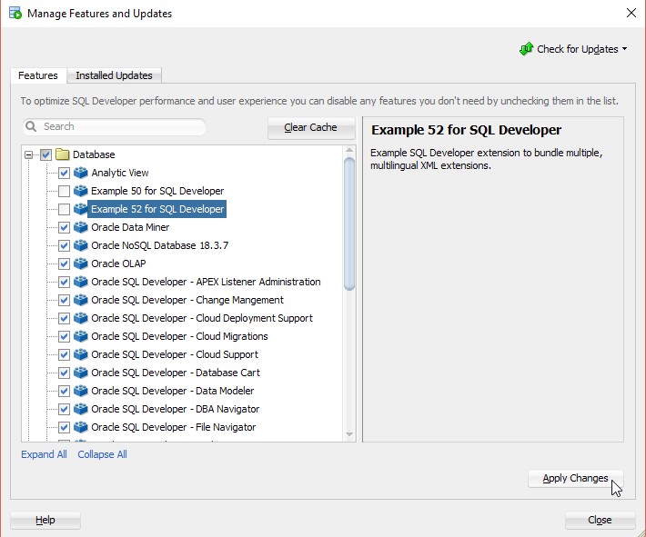

Press `Yes` to restart SQL Developer.

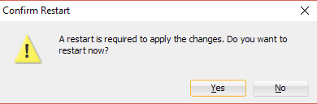

## 6. Install Extension

Select `Help`->`Check for Updates...` from the main menu.

Click on `Install From Local File(s)`, enter `C:\git\sqldev\examples\060_menubar\target\Example60_for_SQLDev_1.0.0-SNAPSHOT.zip` in `File Name(s)` and press `Next`.

Press `Finish`.

And Press `Yes` to restart SQL Developer.

## 7. Run

### 7.1 File Menu

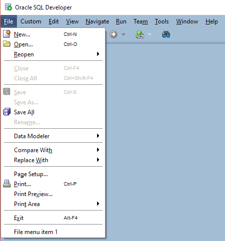

The `File menu item` is added in [`extensions.xml`](https://github.com/PhilippSalvisberg/sqldev/blob/main/examples/060_menubar/extension.xml#L139-L143).

The label is configured in [`ExampleResources.properties`](https://github.com/PhilippSalvisberg/sqldev/blob/main/examples/060_menubar/src/main/resources/com/trivadis/sqldev/example60/ExampleResources.properties#L15).

### 7.2 Custom Menu


The complete custom menu is added in [`extensions.xml`](https://github.com/PhilippSalvisberg/sqldev/blob/main/examples/060_menubar/extension.xml#L186-L204).

The icons are configured in [`ExampleResources.properties`](https://github.com/PhilippSalvisberg/sqldev/blob/main/examples/060_menubar/src/main/resources/com/trivadis/sqldev/example60/ExampleResources.properties#L10-L12).

The accellerator `Ctrl+Shift+A` is configured in 

- [`extensions.xml`](https://github.com/PhilippSalvisberg/sqldev/blob/main/examples/060_menubar/extension.xml#L208-L210)
- [`accelerators.xml`](https://github.com/PhilippSalvisberg/sqldev/blob/main/examples/060_menubar/src/main/resources/com/trivadis/sqldev/example60/accelerators.xml)

Press `Ctrl+Shift+A` to show the following dialog (value for CmdID may differ):


### 7.3 Edit Menu

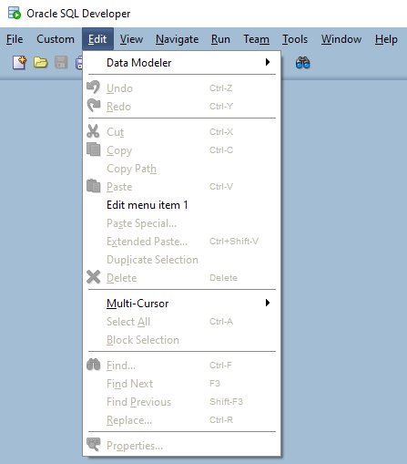

The `Edit menu item 1` is added in [`extensions.xml`](https://github.com/PhilippSalvisberg/sqldev/blob/main/examples/060_menubar/extension.xml#L144-L148).

### 7.4 View Menu

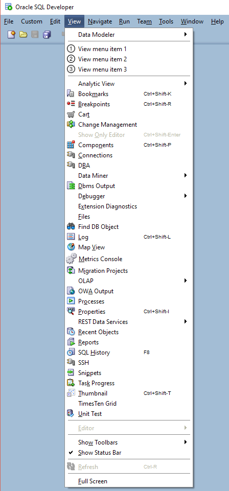

The `View menu item 1`, `View menu item 2` and `View menu item 3` are added in [`extensions.xml`](https://github.com/PhilippSalvisberg/sqldev/blob/main/examples/060_menubar/extension.xml#L149-L155).

### 7.5 Navigate Menu

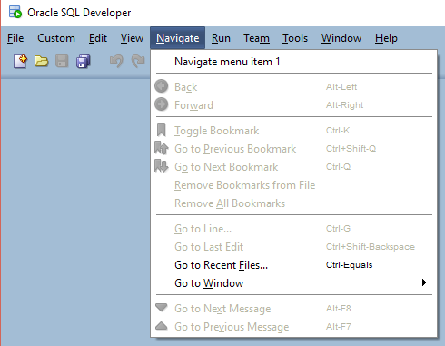

The `View menu item 1` is added in [`extensions.xml`](https://github.com/PhilippSalvisberg/sqldev/blob/main/examples/060_menubar/extension.xml#L156-L160).

### 7.6 Run Menu

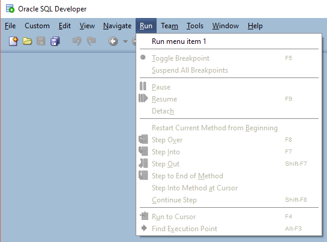

The `Run menu item 1` is added in [`extensions.xml`](https://github.com/PhilippSalvisberg/sqldev/blob/main/examples/060_menubar/extension.xml#L161-L165).

### 7.7 Team Menu

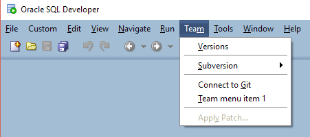

The `Team menu item 1` is added in [`extensions.xml`](https://github.com/PhilippSalvisberg/sqldev/blob/main/examples/060_menubar/extension.xml#L166-L170).

### 7.8 Tools Menu

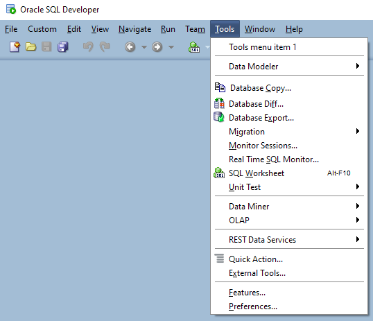

The `Tools menu item 1` is added in [`extensions.xml`](https://github.com/PhilippSalvisberg/sqldev/blob/main/examples/060_menubar/extension.xml#L171-L175).

### 7.9 Window Menu

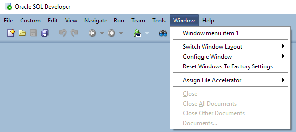

The `Window menu item 1` is added in [`extensions.xml`](https://github.com/PhilippSalvisberg/sqldev/blob/main/examples/060_menubar/extension.xml#L176-L180).

### 7.10 Help Menu

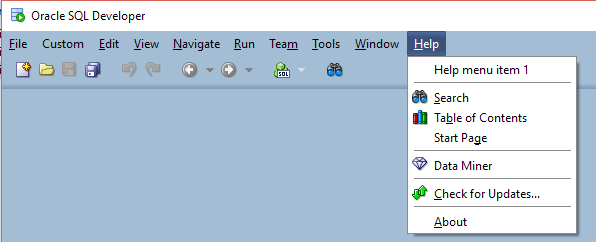

The `Help menu item 1` is added in [`extensions.xml`](https://github.com/PhilippSalvisberg/sqldev/blob/main/examples/060_menubar/extension.xml#L181-L185).

## 8. Important Artefacts/Sections

| Artefact | Section | Notes |
| -------- | ------- | ----- |
| [`extensions.xml`](https://github.com/PhilippSalvisberg/sqldev/blob/main/examples/060_menubar/extension.xml#L19-L110) | Actions | All menu items are actions. There are defined here with label and icon. |
| [`extensions.xml`](https://github.com/PhilippSalvisberg/sqldev/blob/main/examples/060_menubar/extension.xml#L111-L135) | Controllers | Every action must be assigned to a controller to a) enable/disable the item and b) handle the action event. In this case all actions are handled by a single controller class `com.trivadis.sqldev.example60.ExampleController` |
| [`ExampleController.java`](https://github.com/PhilippSalvisberg/sqldev/blob/main/examples/060_menubar/src/main/java/com/trivadis/sqldev/example60/ExampleController.java#L24-L37) | Handle Event| This is the controller class for all events |
