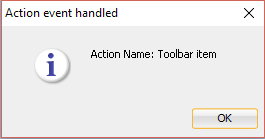
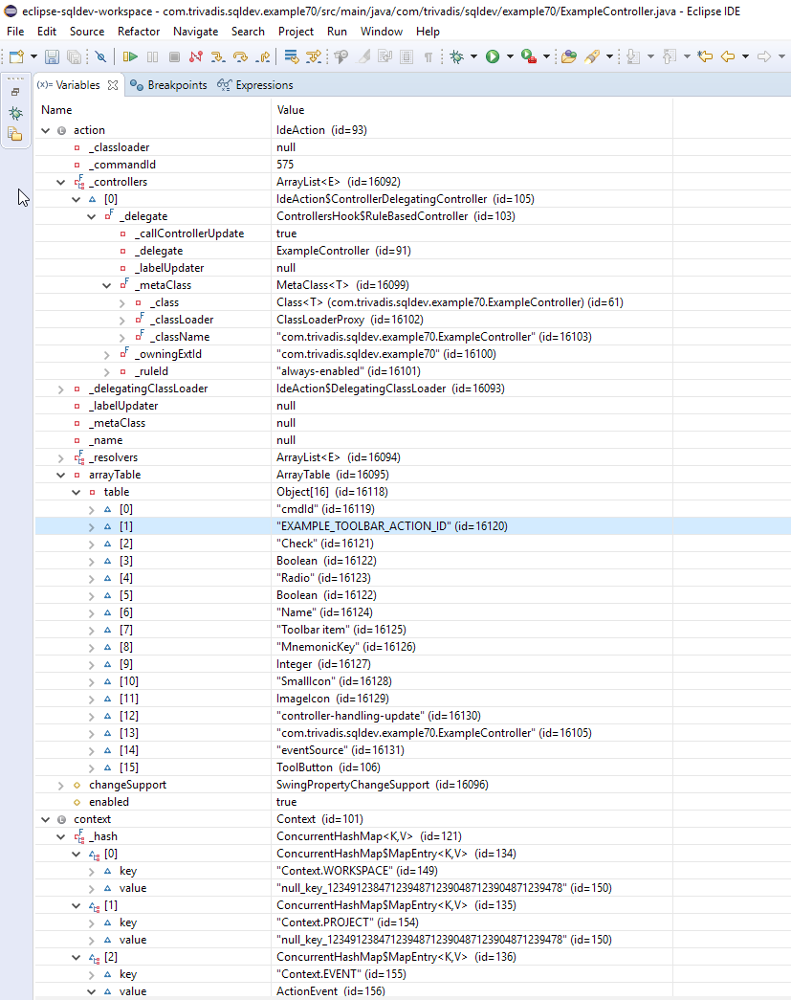
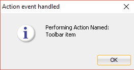

# Extend Toolbar

## 1. Start Eclipse

Start Eclipse and select the `sqldev` workspace created in [Create Bundled XML Extension](https://github.com/PhilippSalvisberg/sqldev/tree/master/workshop/050_create_bundled_xml_extension).

## 2. Open example `070_toolbar`

Select `File`->`Import...` from the main menu.

Select `Existing Maven Projects...`, select the root directory `C:\git\sqldev\examples\070_toolbar` and press `Finish`.

## 3. Build the project

Right click on the project, select `Run As` and click on `Maven build...`.

Enter `clean package` in the `Goals` field and press `Run`.

The console output should look similar to the following:

```text
[[INFO] Scanning for projects...
[INFO] 
[INFO] ---------< com.trivadis.sqldev:com.trivadis.sqldev.example70 >----------
[INFO] Building com.trivadis.sqldev.example70 1.0.0-SNAPSHOT
[INFO] -------------------------------[ bundle ]-------------------------------
...
[INFO] Building zip: C:\git\sqldev\examples\070_toolbar\target\Example70_for_SQLDev_1.0.0-SNAPSHOT.zip
[INFO] ------------------------------------------------------------------------
[INFO] BUILD SUCCESS
[INFO] ------------------------------------------------------------------------
[INFO] Total time: 9.160 s
[INFO] Finished at: 2019-04-24T22:32:27+02:00
[INFO] ------------------------------------------------------------------------
```

## 4. Start SQL Developer

Start SQL Developer.

## 5. Disable Extension

Select `Tools`->`Features` from the main menu.

Open the `Database` node, deselect `Example 60 for SQL Developer` and press `Apply Changes`.

Press `Yes` to restart SQL Developer.

## 6. Install Extension

Select `Help`->`Check for Updates...` from the main menu.

Click on `Install From Local File(s)`, enter `C:\git\sqldev\examples\070_toolbar\target\Example70_for_SQLDev_1.0.0-SNAPSHOT.zip` in `File Name(s)` and press `Next`.

Press `Finish`.

And Press `Yes` to restart SQL Developer.

## 7. Run


Click on the first icon in the toolbar.



## 8. Important Artefacts/Sections

| Artefact | Section | Notes |
| -------- | ------- | ----- |
| [`extensions.xml`](https://github.com/PhilippSalvisberg/sqldev/blob/master/examples/070_toolbar/extension.xml#L17-L46) |  | The toolbar, the action and the controller are defined here. |
| [`ExampleController.java`](https://github.com/PhilippSalvisberg/sqldev/blob/master/examples/070_toolbar/src/main/java/com/trivadis/sqldev/example70/ExampleController.java#L19-L23) | Handle Event| This is the controller class. The code is simplified since just one is event is handled in this controller. |

## 9. Debugging and Hot Deployment

Follow the instructions in [Remote Debugging in Eclipse](https://github.com/PhilippSalvisberg/sqldev/blob/master/docs/remote-debugging.md) to set up remote debugging of an extension in SQL Developer.

Set a breakpoint on line 21 in [`ExampleController.java`](https://github.com/PhilippSalvisberg/sqldev/blob/master/examples/070_toolbar/src/main/java/com/trivadis/sqldev/example70/ExampleController.java#L21) in Eclipse and start the debugger.

Press the toolbar item in SQL Developer.

Inspect the `action` and `context` variables.



Change String text on line 21 from `Action Name:` to `Performing Action Named:`.

Press Ctrl-S to save the changes and deploy the changes immediatly to SQL Developer.

Press F8 to resume processing. The following amended dialog box should be shown:



Disconnect the debugging session. 

Changes via hot deployment are temporary. They are lost after a restart of SQL Developer. 
