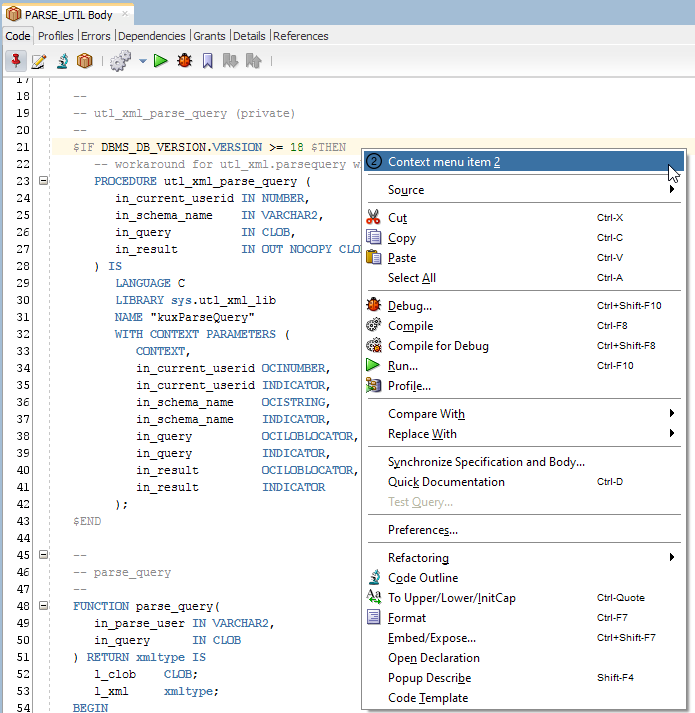
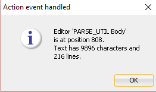

# Extend Context Menu

## 1. Start Eclipse

Start Eclipse and select the `sqldev` workspace created in [Create Bundled XML Extension](https://github.com/PhilippSalvisberg/sqldev/tree/main/workshop/050_create_bundled_xml_extension).

## 2. Open example `080_context_menu`

Select `File`->`Import...` from the main menu.

Select `Existing Maven Projects...`, select the root directory `C:\git\sqldev\examples\080_context_menu` and press `Finish`.

## 3. Build the project

Right click on the project, select `Run As` and click on `Maven build...`.

Enter `clean package` in the `Goals` field and press `Run`.

The console output should look similar to the following:

```text
[INFO] Scanning for projects...
[INFO] 
[INFO] ---------< com.trivadis.sqldev:com.trivadis.sqldev.example80 >----------
[INFO] Building com.trivadis.sqldev.example80 1.0.0-SNAPSHOT
[INFO] -------------------------------[ bundle ]-------------------------------
...
[INFO] Building zip: C:\git\sqldev\examples\080_context_menu\target\Example80_for_SQLDev_1.0.0-SNAPSHOT.zip
[INFO] ------------------------------------------------------------------------
[INFO] BUILD SUCCESS
[INFO] ------------------------------------------------------------------------
[INFO] Total time: 8.817 s
[INFO] Finished at: 2019-04-24T23:26:01+02:00
[INFO] ------------------------------------------------------------------------
```

## 4. Start SQL Developer

Start SQL Developer.

## 5. Disable Extension

Select `Tools`->`Features` from the main menu.

Open the `Database` node, deselect `Example 70 for SQL Developer` and press `Apply Changes`.

Press `Yes` to restart SQL Developer.

## 6. Install Extension

Select `Help`->`Check for Updates...` from the main menu.

Click on `Install From Local File(s)`, enter `C:\git\sqldev\examples\080_context_menu\target\Example80_for_SQLDev_1.0.0-SNAPSHOT.zip` in `File Name(s)` and press `Next`.

Press `Finish`.

And Press `Yes` to restart SQL Developer.

## 7. Run

### 7.1 Connection Node Context Menu

Right click on a connection and select `Context menu item 1`.


The connection will be opened in the background and you should get a dialog similar to the following.


Please note that the password of the connection is shown.

### 7.2 Editor Context Menu

Open a PL/SQL package, position the cursor somewhere in the editor, right click and select `Context menu item 2`.



You should get a dialog similar to the following.



## 8. Important Artefacts/Sections

| Artefact | Section | Notes |
| -------- | ------- | ----- |
| [`extensions.xml`](https://github.com/PhilippSalvisberg/sqldev/blob/main/examples/080_context_menu/extension.xml#L52-L60) | Connection Context Menu Item | Extends context menu for the site `db_nav`. To determine the node a custom rule `example-dbnode-is-db-connection` is used. |
| [`extensions.xml`](https://github.com/PhilippSalvisberg/sqldev/blob/main/examples/080_context_menu/extension.xml#L18-L25) | Rules | Here is the rule `example-dbnode-is-db-connection` defined. It checks if the node is an instance of a `DatabaseConnection` class. |
| [`extensions.xml`](https://github.com/PhilippSalvisberg/sqldev/blob/main/examples/080_context_menu/extension.xml#L61-L69) | Editor Context Menu Item | Extends context menu for the site `editor`. In this case the context menu should be shown aloways. Hence the predefined rule `always-enabled` is used. |
| [`extensions.xml`](https://github.com/PhilippSalvisberg/sqldev/blob/main/examples/080_context_menu/extension.xml#L27-L41) | Actions | All actions are defined here. |
| [`extensions.xml`](https://github.com/PhilippSalvisberg/sqldev/blob/main/examples/080_context_menu/extension.xml#L27-L41) | Controllers | All actions are handled in a single controller class named `ExampleController`. |
| [`ExampleController.java`](https://github.com/PhilippSalvisberg/sqldev/blob/main/examples/080_context_menu/src/main/java/com/trivadis/sqldev/example80/ExampleController.java#L90-L101) | Handle Event| This is the controller class. The two actions are identified here and processed in dedicated private methods [`handleConnection`](https://github.com/PhilippSalvisberg/sqldev/blob/main/examples/080_context_menu/src/main/java/com/trivadis/sqldev/example80/ExampleController.java#L32-L75) and [`handleEditor`](https://github.com/PhilippSalvisberg/sqldev/blob/main/examples/080_context_menu/src/main/java/com/trivadis/sqldev/example80/ExampleController.java#L77-L88) |
