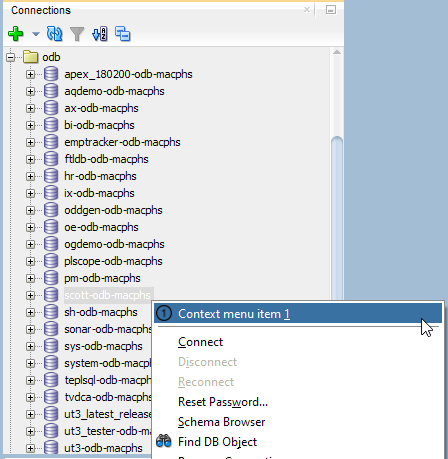
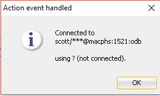

# Add Preferences

## 1. Start Eclipse

Start Eclipse and select the `sqldev` workspace created in [Create Bundled XML Extension](https://github.com/PhilippSalvisberg/sqldev/tree/master/workshop/050_create_bundled_xml_extension).

## 2. Open example `090_preferences`

Select `File`->`Import...` from the main menu.

Select `Existing Maven Projects...`, select the root directory `C:\git\sqldev\examples\090_preferences` and press `Finish`.

## 3. Build the project

Right click on the project, select `Run As` and click on `Maven build...`.

Enter `clean package` in the `Goals` field and press `Run`.

The console output should look similar to the following:

```text
[INFO] Scanning for projects...
[INFO] 
[INFO] ---------< com.trivadis.sqldev:com.trivadis.sqldev.example90 >----------
[INFO] Building com.trivadis.sqldev.example90 1.0.0-SNAPSHOT
[INFO] -------------------------------[ bundle ]-------------------------------
...
[INFO] Building zip: C:\git\sqldev\examples\090_preferences\target\Example90_for_SQLDev_1.0.0-SNAPSHOT.zip
[INFO] ------------------------------------------------------------------------
[INFO] BUILD SUCCESS
[INFO] ------------------------------------------------------------------------
[INFO] Total time: 11.245 s
[INFO] Finished at: 2019-04-25T00:21:47+02:00
[INFO] ------------------------------------------------------------------------
```

## 4. Start SQL Developer

Start SQL Developer.

## 5. Disable Extension

Select `Tools`->`Features` from the main menu.

Open the `Database` node, deselect `Example 80 for SQL Developer` and press `Apply Changes`.

Press `Yes` to restart SQL Developer.

## 6. Install Extension

Select `Help`->`Check for Updates...` from the main menu.

Click on `Install From Local File(s)`, enter `C:\git\sqldev\examples\090_preferences\target\Example90_for_SQLDev_1.0.0-SNAPSHOT.zip` in `File Name(s)` and press `Next`.

Press `Finish`.

And Press `Yes` to restart SQL Developer.

## 7. Run

### 7.1 Preferences

Select `Tools`->`Preferences` from the main menu.

Select `Example 90` in the Preferences dialog.


Uncheck `Show password?` and press `OK`.

## 7.2 Connection Context Menu

Right click on a closed connection and select `Context menu item 1`.



The connection will be opened in the background and you should get a dialog similar to the following.



Please note that 

- The password of the connection is hidden
- The connection is still closed
- No database product and version information is shown

### 7.3 Change Preferences

Change preferences for `Example 90` and verify the the impact.

## 8. Important Artefacts/Sections

| Artefact | Section | Notes |
| -------- | ------- | ----- |
| [`extensions.xml`](https://github.com/PhilippSalvisberg/sqldev/blob/master/examples/090_preferences/extension.xml#L70-L75) | Preferences | The class `PreferencePanel` is registered under `/preferences`. |
| [`PreferencePanel.java`](https://github.com/PhilippSalvisberg/sqldev/blob/master/examples/090_preferences/src/main/java/com/trivadis/sqldev/example90/PreferencePanel.java#L20-L28) |  | The layout is defined here. It reads the model on entry and writes it on exit. |
| [`PreferenceModel.java`](https://github.com/PhilippSalvisberg/sqldev/blob/master/examples/090_preferences/src/main/java/com/trivadis/sqldev/example90/PreferenceModel.java#L21-L35) |  | The getter and setter are defined here. The model is persisted via a provided `HashStructure`. |
| [`ExampleController.java`](https://github.com/PhilippSalvisberg/sqldev/blob/master/examples/090_preferences/src/main/java/com/trivadis/sqldev/example90/ExampleController.java#L50) | Reading Preferences | Instantiate preference model. |
| [`ExampleController.java`](https://github.com/PhilippSalvisberg/sqldev/blob/master/examples/090_preferences/src/main/java/com/trivadis/sqldev/example90/ExampleController.java#L59-L63) | Show password? | Conditional processing regarding password. |
| [`ExampleController.java`](https://github.com/PhilippSalvisberg/sqldev/blob/master/examples/090_preferences/src/main/java/com/trivadis/sqldev/example90/ExampleController.java#L65-L72) | Implicit connect? | Conditional processing regarding implicit connection |
