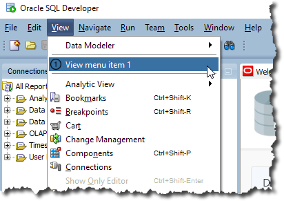
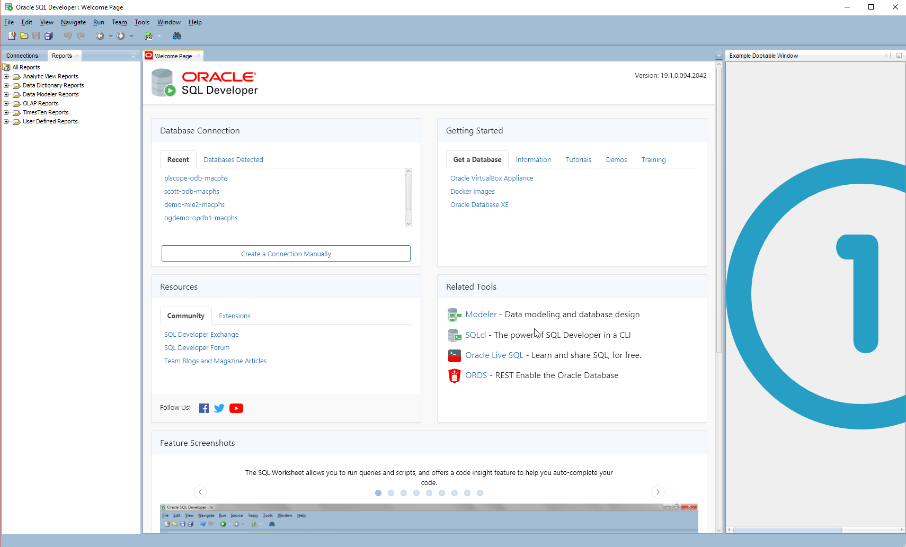
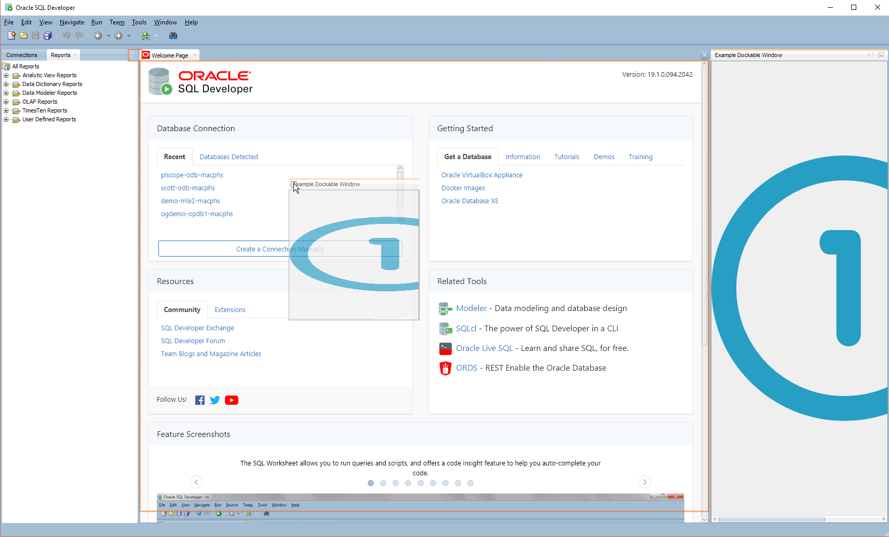

# Add Dockable Window

## 1. Start Eclipse

Start Eclipse and select the `sqldev` workspace created in [Create Bundled XML Extension](https://github.com/PhilippSalvisberg/sqldev/tree/master/workshop/050_create_bundled_xml_extension).

## 2. Open example `100_dockable`

Select `File`->`Import...` from the main menu.

Select `Existing Maven Projects...`, select the root directory `C:\git\sqldev\examples\100_dockable` and press `Finish`.

## 3. Build the project

Right click on the project, select `Run As` and click on `Maven build...`.

Enter `clean package` in the `Goals` field and press `Run`.

The console output should look similar to the following:

```text
[INFO] Scanning for projects...
[INFO] 
[INFO] ---------< com.trivadis.sqldev:com.trivadis.sqldev.example100 >---------
[INFO] Building com.trivadis.sqldev.example100 1.0.0-SNAPSHOT
[INFO] -------------------------------[ bundle ]-------------------------------
...
[INFO] Building zip: C:\git\sqldev\examples\100_dockable\target\Example100_for_SQLDev_1.0.0-SNAPSHOT.zip
[INFO] ------------------------------------------------------------------------
[INFO] BUILD SUCCESS
[INFO] ------------------------------------------------------------------------
[INFO] Total time: 7.649 s
[INFO] Finished at: 2019-04-25T01:08:35+02:00
[INFO] ------------------------------------------------------------------------
```

## 4. Start SQL Developer

Start SQL Developer.

## 5. Disable Extension

Select `Tools`->`Features` from the main menu.

Open the `Database` node, deselect `Example 90 for SQL Developer` and press `Apply Changes`.

Press `Yes` to restart SQL Developer.

## 6. Install Extension

Select `Help`->`Check for Updates...` from the main menu.

Click on `Install From Local File(s)`, enter `C:\git\sqldev\examples\100_dockable\target\Example100_for_SQLDev_1.0.0-SNAPSHOT.zip` in `File Name(s)` and press `Next`.

Press `Finish`.

And Press `Yes` to restart SQL Developer.

## 7. Run

Select `View`->`View menu item 1` from the main menu.



The dockable window position is shown on it's default position on the left side (east).



Drag the dockable window on the `Welcome Page` tab



And drop it.


## 8. Important Artefacts/Sections

| Artefact | Section | Notes |
| -------- | ------- | ----- |
| [`extensions.xml`](https://github.com/PhilippSalvisberg/sqldev/blob/master/examples/100_dockable/extension.xml#L19-L21) | Dockable Factory | The dockable factory class `ExampleDockableFactory` is registered here with the id `EXAMPLE_FACTORY`. |
| [`extensions.xml`](https://github.com/PhilippSalvisberg/sqldev/blob/master/examples/100_dockable/extension.xml#L54-L59) | Dockable View | The dockable view id `EXAMPLE_VIEW` is registered here. |
| [`DockableWindow.java`](https://github.com/PhilippSalvisberg/sqldev/blob/master/examples/100_dockable/src/main/java/com/trivadis/sqldev/example100/ExampleDockable.java#L36-L44) |  | The content of the dockable window is defined here. |
| [`DockableFactory.java`](https://github.com/PhilippSalvisberg/sqldev/blob/master/examples/100_dockable/src/main/java/com/trivadis/sqldev/example100/ExampleDockableFactory.java#L46-L49) |  | The dockable window is instantiated via a `showDockable` call. |
| [`ExampleController.java`](https://github.com/PhilippSalvisberg/sqldev/blob/master/examples/100_dockable/src/main/java/com/trivadis/sqldev/example100/ExampleController.java#L15) |  | Show the dockable window via action event. |
