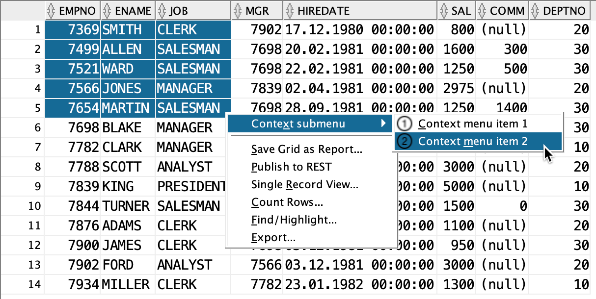
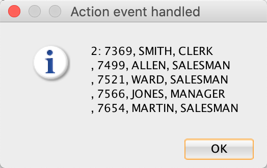

# Extend Context Menu of Grid Table

## 1. Start Eclipse

Start Eclipse and select the `sqldev` workspace created in [Create Bundled XML Extension](https://github.com/PhilippSalvisberg/sqldev/tree/master/workshop/050_create_bundled_xml_extension).

## 2. Open example `110_grid_table_menu`

Select `File`->`Import...` from the main menu.

Select `Existing Maven Projects...`, select the root directory `C:\git\sqldev\examples\110_grid_table_menu` and press `Finish`.

## 3. Build the project

Right click on the project, select `Run As` and click on `Maven build...`.

Enter `clean package` in the `Goals` field and press `Run`.

The console output should look similar to the following:

```text
[INFO] Scanning for projects...
[INFO] 
[INFO] ---------< com.trivadis.sqldev:com.trivadis.sqldev.example110 >---------
[INFO] Building com.trivadis.sqldev.example110 1.0.0-SNAPSHOT
[INFO] -------------------------------[ bundle ]-------------------------------
[INFO] 
[INFO] --- maven-clean-plugin:2.5:clean (default-clean) @ com.trivadis.sqldev.example110 ...
...
[INFO] Building zip: /Users/phs/github/sqldev/examples/110_grid_table_menu/target/Example110_for_SQLDev_1.0.0-SNAPSHOT.zip
[INFO] ------------------------------------------------------------------------
[INFO] BUILD SUCCESS
[INFO] ------------------------------------------------------------------------
[INFO] Total time:  5.018 s
[INFO] Finished at: 2020-05-14T18:32:44+02:00
[INFO] ------------------------------------------------------------------------
```

## 4. Start SQL Developer

Start SQL Developer.

## 5. Disable Extension

Select `Tools`->`Features` from the main menu.

Open the `Database` node, deselect `Example 100 for SQL Developer` and press `Apply Changes`.

Press `Yes` to restart SQL Developer.

## 6. Install Extension

Select `Help`->`Check for Updates...` from the main menu.

Click on `Install From Local File(s)`, enter `C:\git\sqldev\examples\110_context_menu\target\Example110_for_SQLDev_1.0.0-SNAPSHOT.zip` in `File Name(s)` and press `Next`.

Press `Finish`.

And Press `Yes` to restart SQL Developer.

## 7. Run

### 7.1 Show Context Menu Item 1

Open a connection and a worksheet and run a query, for example

```
select * from emp;
```

Select a cell in the result grid and right click anywhere on the grid table.


Select `Context submenu` and there `Context menu item 1`.


### 7.2 Show Context Menu Item 2

Select multiple cells in the result grid and press right click anywhere on the grid table.



Select `Context submenu` and there `Context menu item 2`.



Alternatively, you can click on the icon in the toolbar to achieve the same result.

## 8. Important Artefacts/Sections

| Artefact | Section | Notes |
| -------- | ------- | ----- |
| [`extensions.xml`](https://github.com/PhilippSalvisberg/sqldev/blob/master/examples/110_grid_table_menu/extension.xml#L24-L37) | Actions | All actions are defined here. |
| [`extensions.xml`](https://github.com/PhilippSalvisberg/sqldev/blob/master/examples/110_grid_table_menu/extension.xml#L38-L47) | Controllers | All actions are handled in a single controller class named [`ExampleController`](https://github.com/PhilippSalvisberg/sqldev/blob/master/examples/110_grid_table_menu/src/main/java/com/trivadis/sqldev/example110/ExampleController.java#L20). |
| [`extensions.xml`](https://github.com/PhilippSalvisberg/sqldev/blob/master/examples/110_grid_table_menu/extension.xml#L48-L58) | Toolbar | This is a trick to load the extension without user interaction. On the other hand, it is also a valid option to provide frequently used actions in the toolbar. |
| [`extensions.xml`](https://github.com/PhilippSalvisberg/sqldev/blob/master/examples/110_grid_table_menu/extension.xml#L64-L68) | Context Menu | Register the class [`ExampleAddin`](https://github.com/PhilippSalvisberg/sqldev/blob/master/examples/110_grid_table_menu/src/main/java/com/trivadis/sqldev/example110/ExampleAddin.java#L9). This must be done programmatically. |
| [`ExampleAddin.java`](https://github.com/PhilippSalvisberg/sqldev/blob/master/examples/110_grid_table_menu/src/main/java/com/trivadis/sqldev/example110/ExampleAddin.java#L14-L18) | initialize | This method is called when the extension is loaded. The [`ExampleContextMenu`](https://github.com/PhilippSalvisberg/sqldev/blob/master/examples/110_grid_table_menu/src/main/java/com/trivadis/sqldev/example110/ExampleContextMenu.java#L11) is registered for all instances of `RaptorGridTable`. This class and its descendants are used for basically all grid tables in SQL Developer. |
| [`ExampleContextMenu.java`](https://github.com/PhilippSalvisberg/sqldev/blob/master/examples/110_grid_table_menu/src/main/java/com/trivadis/sqldev/example110/ExampleContextMenu.java#L31-L37) | createAndShowMenu | This method creates the context menu programatically. In the [`canShow`](https://github.com/PhilippSalvisberg/sqldev/blob/master/examples/110_grid_table_menu/src/main/java/com/trivadis/sqldev/example110/ExampleContextMenu.java#L22-L28) method, the selected grid table is saved for later use. |
| [`ExampleController.java`](https://github.com/PhilippSalvisberg/sqldev/blob/master/examples/110_grid_table_menu/src/main/java/com/trivadis/sqldev/example110/ExampleController.java#L85-L95) | Handle Event| This is the controller class. The two actions are identified here and processed in the private method [`show`](https://github.com/PhilippSalvisberg/sqldev/blob/master/examples/110_grid_table_menu/src/main/java/com/trivadis/sqldev/example110/ExampleController.java#L60-L82). SQL Developer uses a `RaptorGridTable` in various places. Usually the right grid table can be identified via the view. But for parent/child reports only the parent grid table is accessible. In these cases [`ExampleContextMenu.getContextGridTable()`](https://github.com/PhilippSalvisberg/sqldev/blob/master/examples/110_grid_table_menu/src/main/java/com/trivadis/sqldev/example110/ExampleController.java#L69) is used to get the "right" grid table. |
